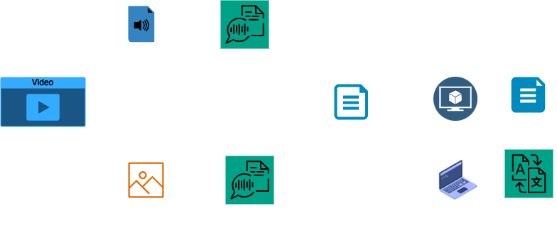

# **GlobalLearn: A VideoGPT**  

## **Table of Contents**
1. [Introduction](#introduction)  
2. [Features](#features)  
3. [Methodology](#methodology)  
4. [Results](#results)  
5. [Installation and Usage](#installation-and-usage)  
6. [Contributors](#contributors)  
7. [Demo Video](#Demo-Video)

---

## **Introduction**
GlobalLearn is an educational application that **summarizes educational videos** into text format in **multiple languages** and allows users to **prompt questions** based on the video content.  

The app uses **audio and image processing techniques** to extract text and generate a concise summary. Additionally, a **Retrieval-Augmented Generation (RAG) model** is implemented to answer user queries based on the extracted text.  

---

## **Features**
- **Automatic Video Summarization**: Converts video content into structured text.  
- **Multimodal Data Extraction**:
  - **Audio-based transcript extraction**  
  - **Image-based text extraction (when audio is unavailable)**  
- **Multi-Language Support**: Summarized text can be translated into various languages.  
- **Question-Answering System**: Users can prompt questions and receive answers based on the video content.  
- **Efficient Processing**: Generates summaries quickly, even in CPU runtime environments.  

---

## **Methodology**

### **1. Data Collection & Preprocessing**
- Collect videos from a single subject.  
- Convert video into **audio and image frames**.  
- Extract **transcripts from audio**.  
- Extract **text from images** (when audio is muted).  
- Clean and structure the extracted text.  

### **2. Knowledge Base Construction**
- Combine text from **audio & images**.  
- Create a **Retrieval-Augmented Generation (RAG) corpus** to facilitate question answering.  

### **3. Summarization & Translation**
- Generate a **concise summary** of the extracted text.  
- Provide translations into multiple languages.  

### **4. User Interface & Deployment**
- Build an interface to **upload videos & prompt questions**.  
- Deploy a **server** to run all models and functionalities.  

---

## **Results**
- **TF-IDF Similarity Score**: **0.46**  
  - Ensures key terms are used without copying transcript structure.  
- **Semantic Similarity Score**: **0.82**  
  - Ensures summaries retain meaning while using different sentence structures.  
- **Processing Time**:
  - For a **10-minute video**, summary generation takes around **4 minutes** on a **CPU-based system**.  

### **Key Outcomes**
✅ Works with videos that **lack transcripts**.  
✅ Combines **audio & image-based text extraction**.  
✅ Supports **multilingual summaries**.  
✅ Enables **question-answering based on video content**.  

---

## **Installation and Usage**
### **Prerequisites**
- Python 3.x  
- Required libraries (install via `requirements.txt`)  

### **Installation**
```bash
git clone https://github.com/praths71018/Video_Text_Summarisation_And_Prompting.git
cd Video_Text_Summarisation_And_Prompting
```

### **Running the Application**
1. Go to the backend directory and create a virtual environment:
   ```bash
   cd backend
   python -m venv venv
   ```
2. Activate the virtual environment:
   ```bash
   source venv/bin/activate
    ```
3. Install requirements:
   ```bash
   pip install -r requirements.txt
   ```
4. **Start the backend server**:
   ```bash
   python backend/app.py
   ```
5. Activate the **frontend**:
   ```bash
   cd frontend
   npm install
   npm start
   ```
5. **Upload a video** through the web interface.
6. **Wait for processing** (transcription, summarization, translation).
7. **Ask questions** based on the generated summary.

---

## **Contributors**
- **Pratham R Shetty**  
- **Prateek M**
- **R Ranjive**
- **Anirudh Krishna**

---

# Demo Video
[DemoVideo.mp4](assets/DemoVideo.mp4)